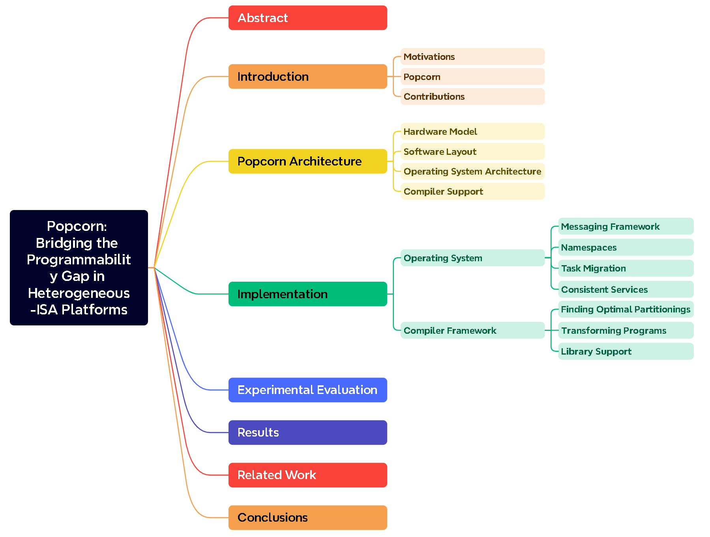

# **阅读部分：**

## **阅读论文的标题、摘要、简介**

题目：popcorn从功能上弥补了异构ISA平台的可编程鸿沟

摘要：采用共享内存编程模型可以增强可编程性；提供了一个由操作系统和编译器框架组成的软件结构，使为同构共享内存编写的程序可以在异构机器之间运行；为了提高表现，还可以把程序分为不同的块分别在不同的isa机器上运行；实验是在intel xeon-xeon phi上进行的

简介：可以让符合POSIX接口并且拥有共享内存的程序在异构ISA机器上运行，将工作负载的代码块映射到不同的ISA处理器上；这个软件结构在不同的isa机器之间提供了共享内存（如果不存在的话），通过将不同的代码块映射到最合适的处理器上

## **阅读章节和子章节的标题**

## **阅读总结**

Popcorn通过deplicated-kernel OS和compiler framework实现了在异构ISA处理器之间运行用于同构ISA处理器之间运行的程序，而且性能比在同构上面还好。之后会探索更加异构的ISA以及cost model

## **阅读引用**

已看

# **收获：**

## **实践/理论？**

实践

## **主要贡献？**

提供了一个系统架构，这个系统架构由一个编译器框架和操作系统构成，这能使编写于同构ISA机器之间运行的程序能够在异构ISA机器上运行，并且程序可以分为不同的块，每个块会根据特性在最适合的ISA上运行

# round2

1.1-motivation
