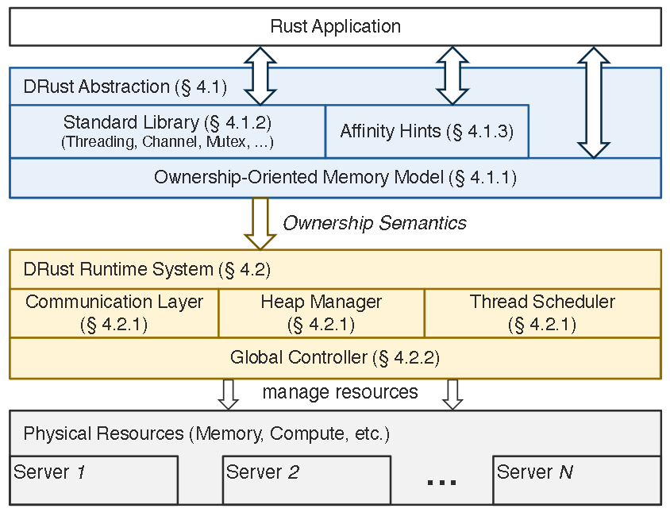
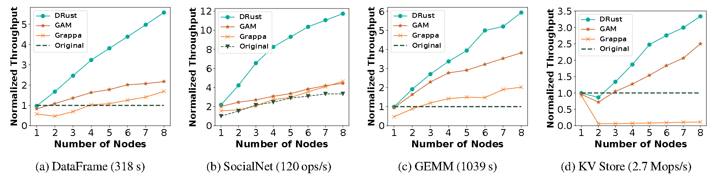

# DRust:Languaged-Guided Distributed Shared Memory with Fine Granularity, Full Transparency, Ultra Efficiency

## 技术概念

single-machine和distributed environment

* CPU、内存等都在一台计算机上，程序也在一台计算机上运行
* 通过网络连接多台计算机，程序在多台计算机上运行，通过网络进行通信和数据交换

Distributed Shared Memory

* 通过网络，将各个计算机的内存连接起来，使内存看起来像一个统一的共享内存
* 程序员在分布式环境上开发像在单机环境上开发一样方便

Languaded-Guided

* 利用编程语言的某种特性来优化某种系统行为
* 利用rust语言的ownership特性，优化和简化DSM

## 研究背景

使用了DSM的分布式环境的表现应该比单机环境的表现要好(负载均衡)

但是由于确保内存一致性的同步操作开销大，表现却不如单机环境

> 内存一致性：通过规定内存操作的顺序和可见性，确保程序的正确性和一致性
>
> * 如果没有内存一致性，不同处理器看到的内存状态可能会不一致，导致程序行为不可预测
> * A要写C的内存，B要读C的内存，读在写后，B读的必须是A新写的值

## 现有方案

single-writer-multiple-reader(SWMR)：

* 读：在各个节点上都复制一份
* 写：只存在于一个节点上

如果一个节点要访问一个数据块：

* 读
  * 检查数据块的状态：在本地，直接读；不在本地，复制到本地，再读
* 写
  * 检查数据块的状态：在本地，让该数据块在其他节点的副本失效，然后写；不在本地，让数据块在其他节点的副本失效，复制到本地，传送到本地，然后再写

> data block：DSM系统进行数据管理和同步的基本单位；内存中的一段连续存储区域；一个整数或浮点数，一个结构体；

## 问题

需要太多网络通信，延迟大

## 解决方案

### 现象

用实现了ownership type的rust语言编程的程序”自动“遵守了SWMR原则

* 每一个value都只有一个variable作为它的owner
* 如果有其他reference想要访问这个value，那就必须borrow，用完后需要return
* 当写操作发生时，最多只能有一个reference，而且该reference必须是mutable
* 当读操作发生时，可以有多个reference，而且它们必须是immutable

### DRust

用rust实现的DSM

* 在发生写操作的时候，不需要显示地让数据块在其他节点的副本失效
* 在发生读操作的时候，数据块可以高效地复制到本地节点并缓存

## 设计概述

### DRust Abstraction

#### Manage Memory

Rust的所有权类型系统（ownership type system）原本设计用于单机环境，其中对象的内存地址在创建后保持不变。在分布式环境中，对象可能在不同的机器之间迁移或复制，这打破了单机环境中的假设，可能导致悬空指针（dangling pointers）和内存一致性问题。

解决方案：

* 全局堆：DRust构建了一个跨越多个服务器的全局堆（global heap），基于分区全局地址空间（Partitioned Global Address Space, PGAS）的概念。每个对象在全局堆中都有一个唯一的全局地址，可以从任何服务器访问该对象。
* 内存管理重构 ：DRust重新实现了Rust的内存管理构造，以便在全局堆中分配对象。
* 缓存一致性协议 ：为了加速读取操作，服务器可以缓存对象。DRust设计了一种基于所有权的缓存一致性协议，以确保内存一致性和效率。

具体机制：

* 所有权语义 ：DRust利用所有权语义来消除显式的缓存失效（cache invalidation）需求。多个读取者可以从对象的宿主服务器获取对象的副本并缓存它，但不允许更改对象的全局地址和值。
* 写访问 ：当发生写访问时，必须首先借用所有权。此时，DRust将全局堆中的对象移动到发出写请求的服务器上的新地址。对象地址的更改会自动使使用旧地址的缓存副本失效，并触发后续读取者从最新的地址获取对象。

#### Distributed Threading Utilities

Rust的标准库和程序最初是为单机环境设计的，无法直接处理集群中的分布式资源。例如，一个在服务器A上运行的Rust程序无法在另一个服务器B上创建线程，更不用说在A和B之间同步线程了。

解决方案

* 分布式线程工具 ：DRust通过重构Rust标准库中的关键元素（如线程管理、通信通道和共享状态锁），提供了分布式线程工具。这些工具提供了与单机Rust程序相同的接口，但内部调用DRust的分布式调度器，以确定线程在哪个服务器上运行，并促进跨服务器的同步。
* 关键元素重构 ：线程管理 ，DRust重构了Rust的线程管理模块，使得线程可以在不同的服务器上创建和调度。通信通道 ，DRust提供了分布式通信通道，使得线程之间可以跨服务器进行消息传递。共享状态锁 ，DRust实现了分布式共享状态锁（如Mutex），确保在多服务器环境中可以安全地访问和修改共享数据。

具体机制

* 接口兼容性 ：DRust的分布式线程工具提供了与单机Rust程序相同的接口，使得现有的Rust代码无需修改即可在分布式环境中运行。例如，std::thread::spawn函数在DRust中仍然可以使用，但它内部会调用DRust的分布式调度器。
* 分布式调度器 ：DRust的分布式调度器负责决定线程在哪个服务器上运行。调度器根据当前集群的资源使用情况和负载情况，选择最适合的目标服务器。调度器还负责跨服务器的线程同步，确保线程之间的协调和通信。
* 所有权模型 ：DRust基于所有权模型，确保在分布式环境中安全地传递对象引用。当一个线程需要访问另一个服务器上的对象时，DRust会在解引用时自动从全局堆中获取对象的值。

### DRust Runtime System

一个Rust应用程序可以从单个服务器开始运行。应用程序可以逐渐在其运行过程中创建线程，并将这些线程调度到集群中的其他服务器上。

#### Runtime Library

分布式资源管理 ：

* DRust使用一个运行时系统来管理应用程序的分布式物理计算和内存资源。
* 这个运行时系统作为一个进程运行在集群中的每个节点上。
* 各个节点上的运行时系统协同工作，处理跨服务器的内存分配和线程调度。

资源分配优先级 ：

* 运行时系统优先在当前服务器上进行对象分配和线程创建。
* 如果当前服务器内存压力大，运行时系统会将资源分配请求调度到其他服务器上。

#### Global Controller

全局决策 ：

* DRust有一个全局控制器，与应用程序一起启动。
* 全局控制器负责在集群范围内做出决策，例如决定全局内存分配和线程创建的目标服务器。

资源使用信息收集 ：

* 全局控制器与每个节点上的DRust运行时系统通信，收集资源使用信息。
* 这些信息包括内存使用情况、CPU利用率等。

适应性策略 ：

* 全局控制器根据收集到的资源使用信息，应用适应性策略来实现负载均衡。
* 适应性策略可能包括动态调整线程调度、内存分配等，以优化资源利用和提高系统性能。

### 示例流程

* DRust Abstraction
  * manage memory
    * 对象创建：
      * 在全局堆中创建一个对象，该对象有一个唯一的全局地址
      * 例如，对象A的全局地址为0x1000
    * 读操作：
      * 多个服务器可以读取对A，并将其缓存到本地
      * 服务器1和服务器2都可以从全局地址0x1000读对象A，并将其缓存
    * 写操作：
      * 假设服务器3需要对对象A进行写操作
      * 服务器3首先借用对象A的所有权
      * DRust将对象A从全局地址0x1000移动到服务器3上的新地址0x2000，然后写
    * 缓存失效和更新缓存
      * 对象A的地址从0x1000变为0x2000，这会自动使服务器1和服务器2中使用旧地址0x1000的缓存副本失效
      * 服务器1和服务器2在下次读取对象A时，会从最新的地址0x2000获取对象A的新副本
* DRust Runtime System
  * 应用程序启动：
    * 用户在一个服务器上启动Rust应用程序
    * 应用程序开始运行，初始线程在启动服务器上执行
  * 线程扩展：
    * 随着应用程序的需求增加，需要更多的计算资源
    * 应用程序通过编程接口请求创建新的线程
  * 运行时决策：
    * DRust运行时系统接收到线程创建请求
    * 运行时系统首先尝试在当前服务器上创建线程和分配内存
    * 如果当前服务器资源紧张，运行时系统将请求发送到全局控制器
  * 全局控制器干预：
    * 全局控制器根据集群中各节点的资源使用情况，选择最适合的目标服务器
    * 全局控制器通知目标服务器上的DRust运行时系统
  * 资源分配：
    * 目标服务器上的DRust运行时系统接收请求，创建线程并分配内存
    * 新创建的线程开始在目标服务器上执行
  * 持续监控和优化：
    * 全局控制器持续监控集群中各节点的资源使用情况
    * 根据实时数据，全局控制器动态调整资源分配和线程调度，以保持负载均衡

## 测试结果

选取了四个应用程序

* DataFrame：an in-memory data analytics framework
* SocialNet：a twitter-like web service
* GEMM：highly-optimized matrix multiplication routine from the BLAS library
* KV Store：an in-memory key-value cache engine

测试步骤：

* 在单机环境下运行，用一个node，测量吞吐量
* 在分布式环境下运行，用不同数量的node，测量吞吐量

## 缺点

* 对于unsafe的代码，需要程序员自己保证内存一致性
* 如果写操作过多，那DRust的性能会很低
* 内存布局固定，不安全
