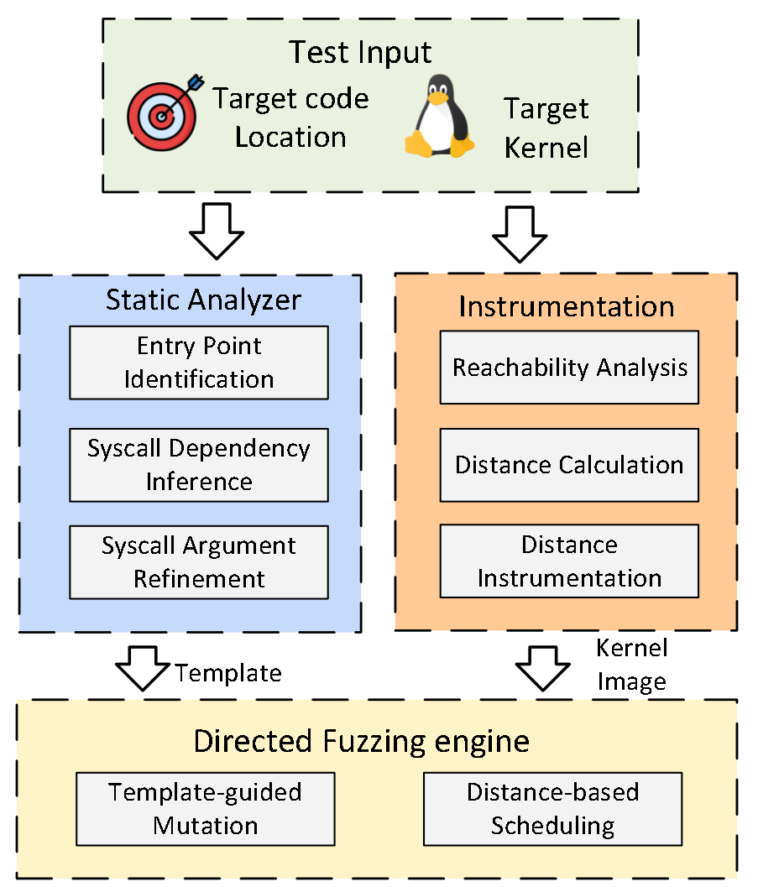

# SyzDirect

Linux内核DGF模糊测试工具，给定某个位置，对该位置进行stress-test。

## 难点

1. 如何确定触发该位置的syscall；
2. 如何确定触发该位置的syscall的参数值。

## 解决方案

* Entry Point Identification：从target入手，得到调用链，分析用到的资源，结合这些信息，筛选可能的目标syscall。即kernel function和syscall的对应，用到了syzlang；
* Syscall Dependency Inference：得到和目标syscall相依赖的syscall，从资源的创建和使用方面来入手，这个在syzlang里面提供了；
* Syscall Argument Refinement：syscall确定后，就会根据条件语句确定系统调用的参数，这个也要结合syzlang；
* Directed Kernel Fuzzing：得到上述信息后，会用来指导种子变异，定制了变异规则；
