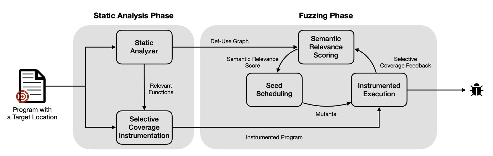
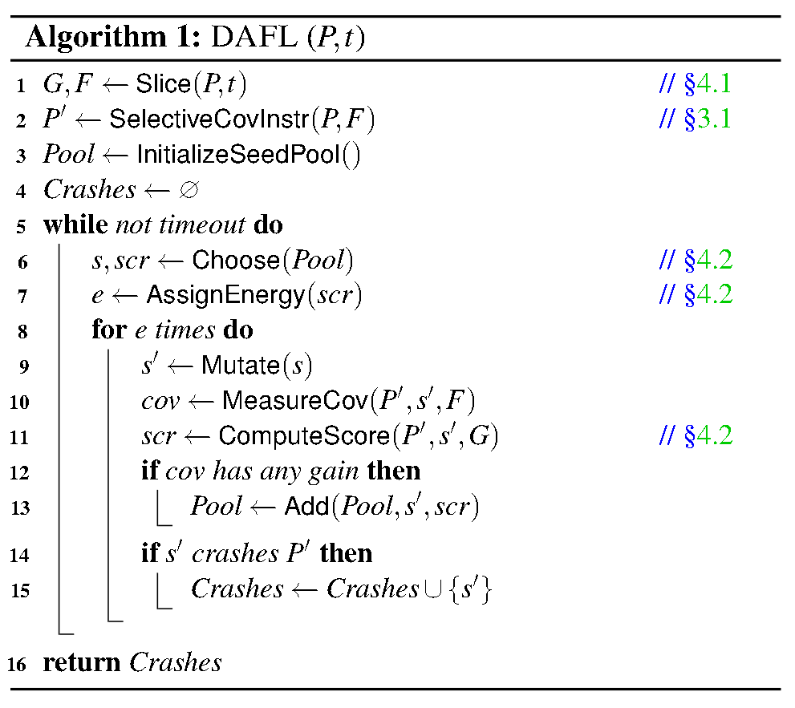

# DAFL

* Static Analysis Phase
  * [Static Analyzer](1-Static-Analyzer.md)
    * Input: a program with an annotated target location
    * Output: Def-Use Graph and a set of relevant functions with respect to the target point
    * Exe: run an inter-procedural static
    * Purpose: identify all the statements that the target location is data-dependent on
  * [Selective Coverage Instrumentation](1-Selective-Coverage-Instrumentation.md)
    * Input: a program with an annotated target location and relevant functions provided by Static Analyzer
    * Output: instrumented program
    * Exe: instrument only the relevant functions in the target program
    * Purpose: enable DAFL to selectively receive coverage feedback only from the dependent parts of the program during the next fuzzing phase
* Fuzzing Phase
  * Instrumented Execution
    * Input: instrumented program
    * Output: selectively coverage feedback
  * [Semantic Relevance Scoring](1-Semantic-Relevance-Scoring.md)
    * Input: selectively coverage feedback
    * Output: semantic relevance score
  * Seed Scheduling
    * Input: semantic relevance score
    * Output: mutants

---

DAFL是一个函数

* 输入：一个程序P还有一个目标程序点t
* 输出：一组崩溃测试用例

Static Analyzer->Slice(P,t)=>G,F

Selective Coverage Instrumentation->SelectiveCovInstr(P,F)=>P'

Instrumented Executation->MeasureCov(P',s',F)=>cov

Semantic Relevance Scoring->ComputeScore(P',s',G)=>scr
